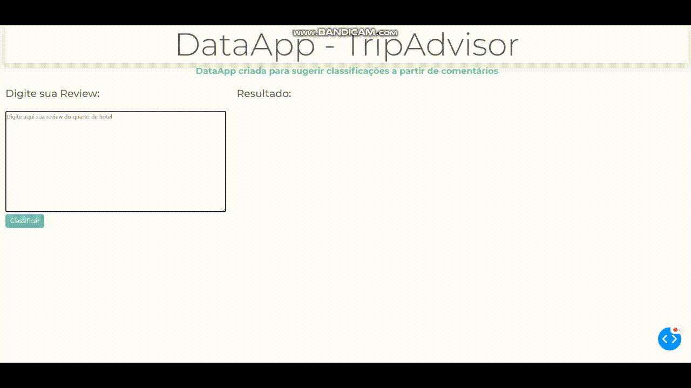

# DataApp TripAdvisor

## PT-BR:

  Neste projeto fiz um classificador que visa ajudar usuários na sujestão de classificação (notas/estrelas) para quartos de hotel .  
 Aqui o usuário dá seu comentário e o algoritmo automaticamente prediz uma classificação , que pode variar de  1 à 5.
 Você pode digitar em qualquer lingua que ele prediz.

 

## EN:

  In this project I made a classifier that aims to help users in the classification suggestion (grades / stars) for hotel rooms.  
  Here the user gives his comment and the algorithm automatically predicts a classification, which can vary from 1 to 5.
  You can type in any language it predicts.

## Uso da Aplicação / Application Use

